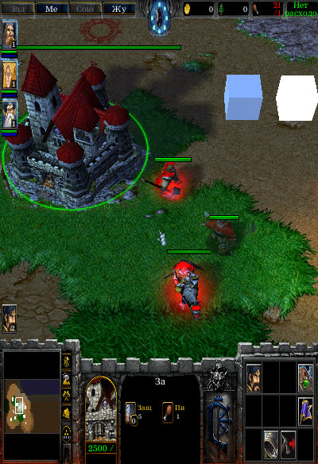
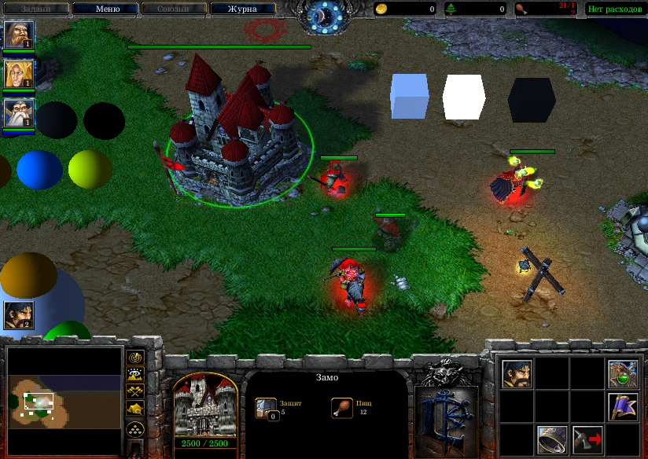
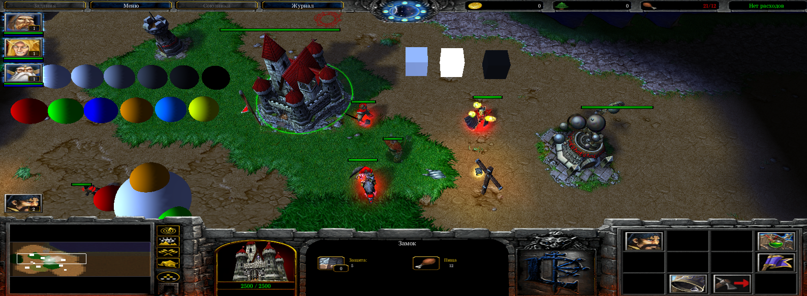

# Widescreen fix for Warcraft III
A standalone version of RenderEdge with only widescreen fix.
Adds support for monitors with aspect ratios wider than 4:3.

  
  
  

# Installation
Put RenderEdge_Widescreen.mix file into the folder where WarCraft III is installed.

**Requirements:**
- Windows XP or above;
- Microsoft Visual C++ Redistributable for Visual Studio 2017 (https://support.microsoft.com/ru-ru/help/2977003/the-latest-supported-visual-c-downloads).

**Supported patches:**
- 1.28.0, 1.28.2, 1.28.4, 1.28.5;
- 1.27a, 1.27b;
- 1.26a;
- 1.24e;
- 1.23a.

# References
**RenderEdge on Nexus Mods:**
- Experimental version (https://www.nexusmods.com/warcraft3/mods/11);
- Widescreen Fix (https://www.nexusmods.com/warcraft3/mods/12).

**RenderEdge on Hiveworkshop:**
- Basic version (http://www.hiveworkshop.com/threads/288375);
- Experimental version (http://www.hiveworkshop.com/threads/288551);
- Widescreen fix (https://www.hiveworkshop.com/threads/293641);
- Memory Hack (https://www.hiveworkshop.com/threads/299926).

**RenderEdge on XGM:**
- http://xgm.guru/p/renderedge.
